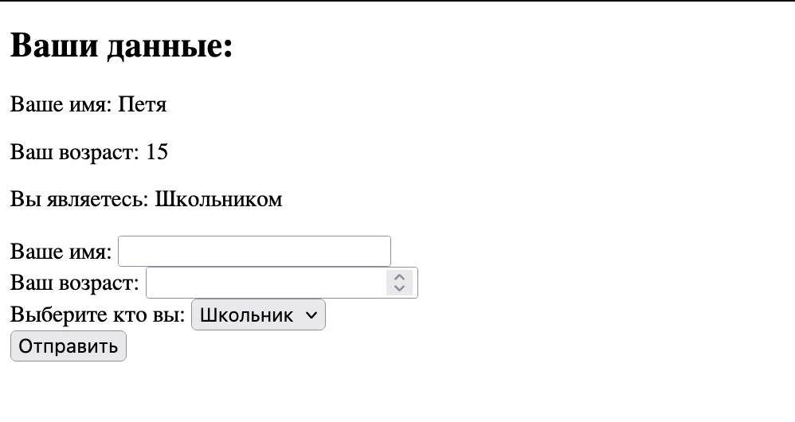

# ЛАБОРАТОРНАЯ РАБОТА №4


### 1.2. Добавьте в отмеченную область код, который будет отображать сообщение только после отправки формы.

```php
<?php
    if ($_SERVER["REQUEST_METHOD"] == "POST") {
        echo '<div id="result">';
        echo '<p>Ваше имя: <b>' . htmlspecialchars($_POST["name"]) . '</b></p>';
        echo '<p>Ваш e-mail: <b>' . htmlspecialchars($_POST["email"]) . '</b></p>';
        echo '<p>Оценка товара: <b>' . htmlspecialchars($_POST["review"]) . '</b></p>';
        echo '<p>Ваше сообщение: <b>' . htmlspecialchars($_POST["comment"]) . '</b></p>';
        echo '</div>';
    }
    ?>
```
### 1.3. Добавьте под формой функцию для проверки данных, гарантирующую заполнение всех полей и корректность введенного e-mail.

```php
<?php
function validateEmail($email) {
    return filter_var($email, FILTER_VALIDATE_EMAIL);
}

if ($_SERVER["REQUEST_METHOD"] == "POST") {
    $name = $_POST["name"];
    $email = $_POST["email"];
    $review = $_POST["review"];
    $comment = $_POST["comment"];

    $errors = [];

    if (empty($name) || empty($email) || empty($review) || empty($comment)) {
        $errors[] = "Пожалуйста заполните все поля.";
    }

    if (!validateEmail($email)) {
        $errors[] = "Неправильный формат почты.";
    }

    if (!empty($errors)) {
        echo '<div id="error">';
        foreach ($errors as $error) {
            echo '<p style="color: red;">' . $error . '</p>';
        }
        echo '</div>';
    } else {
        echo '<div id="result">';
        echo '<p>Ваше имя: <b>' . htmlspecialchars($name) . '</b></p>';
        echo '<p>Ваш e-mail: <b>' . htmlspecialchars($email) . '</b></p>';
        echo '<p>Оценка товара: <b>' . htmlspecialchars($review) . '</b></p>';
        echo '<p>Ваше сообщение: <b>' . htmlspecialchars($comment) . '</b></p>';
        echo '</div>';
    }
}
?>
```

### 1.4. Объясните, что такое глобальная переменная $_POST и $_SERVER[“PHP_SELF”]

$_POST: Это глобальный ассоциативный массив в PHP, который содержит данные, отправленные на скрипт с использованием HTTP метода POST. 

$_SERVER["PHP_SELF"]: Это глобальный ассоциативный массив, который содержит информацию о сервере и текущем выполняющемся сценарии. $_SERVER["PHP_SELF"] возвращает имя файла текущего выполняющегося сценария, что полезно для создания форм, ссылающихся на себя.

## 2. Получение данных с различных контроллеров

2.1. Создайте форму, состоящую минимум из 3 контроллеров (input, select)

2.1.1. Минимум 1 input с типом number

2.1.2. Минимум 1 select

2.2. Тема формы определяется на ваш выбор

2.3. Обработайте данные и выведите их на экран

```php
<!DOCTYPE html>
<html lang="en">
<head>
    <meta charset="UTF-8">
    <meta name="viewport" content="width=device-width, initial-scale=1.0">
    <title>Ваши данные</title>
</head>
<body>

<?php
// Обработка данных при отправке формы
if ($_SERVER["REQUEST_METHOD"] == "POST") {
    // Получение данных из формы
    $inputNameValue = isset($_POST['inputName']) ? $_POST['inputName'] : '';
    $inputNumberValue = isset($_POST['inputNumber']) ? $_POST['inputNumber'] : '';
    $selectValue = isset($_POST['selectOption']) ? $_POST['selectOption'] : '';

    // Вывод данных на экран
    echo "<h2>Ваши данные:</h2>";
    echo "<p>Ваше имя: $inputNameValue</p>";
    echo "<p>Ваш возраст: $inputNumberValue</p>";
    echo "<p>Вы являетесь: $selectValue</p>";
}
?>

<!-- Форма -->
<form method="post" action="<?php echo htmlspecialchars($_SERVER["PHP_SELF"]); ?>">

    <label for="inputName">Ваше имя:</label>
    <input type="name" id="inputName" name="inputName" required>
    <br>
    <label for="inputNumber">Ваш возраст:</label>
    <input type="number" id="inputNumber" name="inputNumber" required>
    <br>
    <label for="selectOption">Выберите кто вы:</label>
    <select id="selectOption" name="selectOption" required>
        <option value="Школьником">Школьник</option>
        <option value="Студентом">Студент</option>
        <option value="Докторатом">Докторат</option>
    </select>
    <br>
    <button type="submit">Отправить</button>
</form>

</body>
</html>
```



## 3. Создание, обработка и валидация форм

```php
<!DOCTYPE html>
<html lang="en">

<head>
    <meta charset="UTF-8">
    <meta name="viewport" content="width=device-width, initial-scale=1.0">
    <title>Document</title>
    <link rel="stylesheet" href="/style.css">
</head>

<body>
    <?php
    error_reporting(E_ERROR | E_PARSE);

    $name = $mail = $comment = $agree = '';
    $errors = [];

    if ($_SERVER["REQUEST_METHOD"] == "POST") {
        $name = $_POST["name"];
        $mail = $_POST["mail"];
        $comment = $_POST["comment"];
        $agree = isset($_POST["agree"]);

        $errors = validateForm($name, $mail, $comment, $agree);
    }

    function validateForm($name, $mail, $comment, $agree)
    {
        $errors = [];

        if (strlen($name) < 3 || strlen($name) > 20 || preg_match("/\d/", $name)) {
            $errors[1] = "Invalid name. It should be 3-20 characters long and contain no digits.";
        }

        if (!filter_var($mail, FILTER_VALIDATE_EMAIL)) {
            $errors[2] = "Invalid email address.";
        }

        if (empty($comment)) {
            $errors[3] = "Comment cannot be empty.";
        }

        if (!$agree) {
            $errors[4] = "You must agree with data processing.";
        }

        return $errors;
    }
    ?>

    <header>
        <div style="margin: 10px;">
            #my-shop
        </div>
        <div class="header_mid">
            <div class="blocks">Home</div>
            <div class="blocks">Comments</div>
        </div>
        <div class="blocks">Exit</div>
    </header>

    <form method="post">
        <fieldset>
            <legend>
                <h1>#write-comment</h1>
            </legend>
            <?php displayFormField("name", "Name", $name, $errors[1]); ?>
            <?php displayFormField("mail", "Mail", $mail, $errors[2]); ?>
            <div class="e_form">
                <label for="comment">Comment:<br><br>
                    <textarea name="comment" id="comment" cols="30" rows="10"><?php echo $comment; ?></textarea>
                    <?php echo $errors[3]; ?>
                </label>
            </div>
            <div style="margin: 10px; font-size: 12px">
                <input type="checkbox" name="agree" id="agree" <?php echo $agree ? 'checked' : ''; ?>>
                <label for="agree">Do you agree with data processing?</label>
                <?php echo $errors[4]; ?>
            </div>
            <div class="submit">
                <input type="submit" value="Send">
            </div>
        </fieldset>
    </form>

    <?php
    if (empty($errors)) {
    ?>
        <div id="result" class="comment-result">
            <p>Your name: <b><?php echo $name ?></b></p>
            <p>Your e-mail: <b><?php echo $mail ?></b></p>
            <p>Your comment: <b><?php echo $comment ?></b></p>
        </div>
    <?php
    }
    ?>

</body>

</html>

<?php
function displayFormField($name, $label, $value, $error)
{
    ?>
    <div class="e_form">
        <label for="<?php echo $name; ?>"><?php echo $label; ?>:
            <input type="text" name="<?php echo $name; ?>" value="<?php echo $value; ?>">
            <?php echo $error; ?>
        </label>
    </div>
    <?php
}
?>
```

```css
header {
    background-color: rgb(221, 221, 221);
    padding: 20px;
    margin-bottom: 20px;
    border-radius: 10px;
    font-family: 'Courier New', Courier, monospace;
    display: flex;
    justify-content: space-between;
}

.header_mid {
    display: flex;
    justify-content: space-between;
}

.blocks {
    background-color: darkgray;
    border-radius: 5px;
    margin: 10px;
    padding: 3px;
}

fieldset{
    border: none;
    padding: 10px;
    margin: 10px;
    font-family: 'Courier New', Courier, monospace
}

.e_form {
    display: flex;
    justify-content: space-between;
    margin: 10px;
}
.e_form input {
    border: 1px solid black;
    border-radius: 5px;
    padding: 4px;
    margin-left: 40px;
}
.e_form textarea {
    border: 1px solid black;
    border-radius: 5px;
    padding: 20px;
}
.submit input{
    padding-left: 25px;
    padding-right: 25px;
    padding-top: 8px;
    padding-bottom: 8px;
    border-radius: 10px;
    margin: 10px;
    border: 1px solid black;
}
.comment-result {
    margin-top: 20px;
    padding: 20px;
    border: 1px solid #ddd;
    border-radius: 5px;
    background-color: rgb(221, 221, 221);
}
.comment-result p {
    margin: 0 0 10px;
    line-height: 1.5;
}
.comment-result b {
    color: #333;
}
```


Проверка на введенные данные:


### 3.5. Чем отличается глобальная переменная $_REQUEST и $_POST?

$_POST в PHP используется для получения данных, отправленных методом POST.

$_REQUEST включает данные из разных источников (POST, GET, куки), но его использование не рекомендуется из-за потенциальных проблем с безопасностью и ясностью кода.
Рекомендуется использовать $_POST для данных POST и явно указывать источник данных, чтобы сделать код более понятным и безопасным.

## 4. Создание формы

### 4.1. Создайте тест из 3-х вопросов используя input, type radio, и input, type checkbox и запросите имя пользователя. Проверьте заполнение формы и варианты, выбранные пользователем. Выведите результаты на экран.

```php
<?php
// Создаем массив с вопросами и ответами
$questions = array(
  array(
    "question" => "Как называется главный файл скрипта на php?",
    "type" => "radio", // тип ввода - радиокнопка
    "options" => array("index.php", "main.php", "script.php", "run.php"), // варианты ответов
    "answer" => "index.php" // правильный ответ
  ),
  array(
    "question" => "Какие из этих функций используются для работы с массивами?",
    "type" => "checkbox", // тип ввода - чекбокс
    "options" => array("array_push", "array_pop", "array_merge", "array_split"), // варианты ответов
    "answer" => array("array_push", "array_pop", "array_merge") // правильные ответы
  ),
  array(
    "question" => "Какой символ используется для конкатенации строк в php?",
    "type" => "radio", // тип ввода - радиокнопка
    "options" => array("+", ".", "*", "/"), // варианты ответов
    "answer" => "." // правильный ответ
  )
);

// Проверяем, была ли отправлена форма
if (isset($_POST['submit'])) {
  $name = $_POST['name'];
  if (empty($name)) {
    // Выводим сообщение об ошибке
    echo "Пожалуйста, введите свое имя.";
  } else {
    // Создаем переменную для подсчета правильных ответов
    $score = 0;
    foreach ($questions as $index => $question) {
      $type = $question['type'];
      $options = $question['options'];
      $answer = $question['answer'];
      // Получаем ответ пользователя из формы
      $user_answer = $_POST['answer' . $index];
      if (empty($user_answer)) {
        // Выводим сообщение об ошибке
        echo "Пожалуйста, выберите ответ на вопрос №" . ($index + 1) . ".<br>";
      } else {
        // Сравниваем ответ пользователя с правильным ответом
        if ($type == "radio") {
          if ($user_answer == $answer) {
            $score++;
          }
        } elseif ($type == "checkbox") {
          if (count($user_answer) == count($answer)) {
            $correct = true;
            foreach ($user_answer as $option) {
              if (!in_array($option, $answer)) {
                $correct = false;
                break;
              }
            }
            if ($correct) {
              $score++;
            }
          }
        }
      }
    }
    // Выводим результаты на экран
    echo "Привет, $name!<br>";
    echo "Твой результат: $score из " . count($questions) . ".<br>";
    foreach ($questions as $index => $question) {
      // Выводим вопрос и ответ пользователя
      echo ($index + 1) . ". " . $question['question'] . "<br>";
      echo "Твой ответ: ";
      // Выводим ответ в зависимости от типа ввода
      if ($question['type'] == "radio") {
        echo $_POST['answer' . $index] . "<br>";
      } elseif ($question['type'] == "checkbox") {
        echo "(" . implode(", ", $_POST['answer' . $index]) . ")<br>";
      }
      echo "Правильный ответ: ";
      if ($question['type'] == "radio") {
        echo $question['answer'] . "<br>";
      } elseif ($question['type'] == "checkbox") {
        echo "(" . implode(", ", $question['answer']) . ")<br>";
      }
      echo "<br>";
    }
  }
} else {
  // Если форма не отправлена, то выводим форму
  echo '<form method="post" action="">';
  echo 'Введите свое имя: <input type="text" name="name"><br><br>';
  foreach ($questions as $index => $question) {
    echo ($index + 1) . ". " . $question['question'] . "<br>";
    if ($question['type'] == "radio") {
      foreach ($question['options'] as $option) {
        echo '<input type="radio" name="answer' . $index . '" value="' . $option . '">' . $option . '<br>';
      }
    } elseif ($question['type'] == "checkbox") {
      foreach ($question['options'] as $option) {
        echo '<input type="checkbox" name="answer' . $index . '[]" value="' . $option . '">' . $option . '<br>';
      }
    }
    echo "<br>";
  }
  echo '<input type="submit" name="submit" value="Отправить">';
  echo '</form>';
}
?>
```
Форма:


Все ответы верные:


Ответы содержат ошибки:


